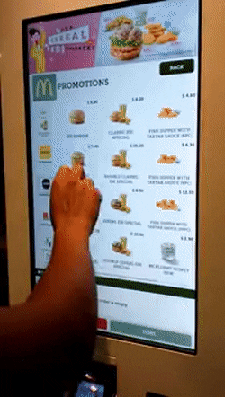
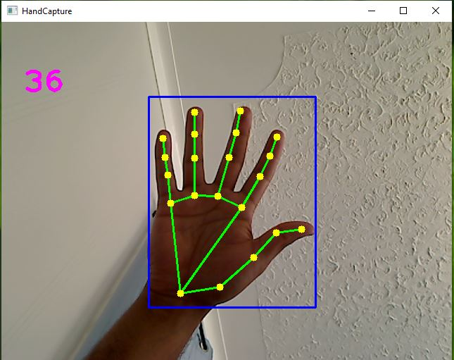
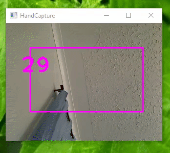

## Food Ordering System based on Hand Gesture Recognition (v 1.0)
Computer vision is the most mainstream field today. 
Hand Gesture is quite possibly the most development continuous 
Research. MediaPipe is an open-source library created by Google 
to comprehend the essentials of computer vision. 
The point of this venture is to expand the limit and bring 
out true items which can assist any association with saving 
expense and time and accomplish better usefulness. Our Aim is to replace the physical touch. 


### Files
- Img -----------------> Contains images for README.md
- README.md ------> This markdown file you are reading.
- hand.py ---------- > First Python file which detects hand.
- mouse.py ---------> Second python file which use first file and blend with a mouse functionality.   
- Requirement.txt--> Required imports to run the program successfully.

### Description
Mediapipe is an exceptionally progressed cv library, created by Google.
[ Visit the site for information ](https://google.github.io/mediapipe/solutions/hands.html "Mediapipe Hands"). 
They make use of two main models Palm detection model and the Hand landmarks model. The point of hand.py is to distinguish hand(s) in the 3d plane and return its (x, y, z) facilitates. 
Any hand(s) has 21 focuses (0 - 20) as displayed underneath. 
Moreover, mouse.py is the main program that interprets 
the hand from hand.py and enables mouse movement using GUI library Autopy.


The following code finds the hand and its coordinate in 3D plane.
``` python
            or id, h_landmarks in enumerate(h_hand.landmark):
                height, width, channel = image.shape

                c_x, c_y = int(h_landmarks.x * width), int(h_landmarks.y * height)

                x_coordinate.append(c_x)
                y_coordinate.append(c_y)

                self.lmlist.append([id, c_x, c_y])
```
### Installation
(Optional) Setup a virtual environment to install necessary packages.
``` commandline
virtualenv .venv
source .venv/bin/activate
```
Install the packages listed in Requirement.txt file
```shell
pip install -r requirements.txt
```
Run Mouse.py to see the final result.

### Usage
This program is simple and can be run using command line in system where python is already installed
```shell
Python mouse.py
```
#### Steps:
1. First, run hands.py, You will see an external window capturing your video and detecting hands.Refer to the image below:

2. After a successful run, open mouse.py and run the file. 
   Now the screen will appear like this:- 
   

3. Now you must point your index finger towards the screen to move the mouse. 
   Any moment if you wish to right-click join your Index and Middle finger. 
   You can open any restaurant food ordering website and treat as kiosk for testing.
   Now, you can add, delete, modify the food items and place you order. 

4. To quit any time simply press q on your keyboard.

_Remember_ the Port(0) is for an internal webcam and Port(1) for any external webcam. Make sure you have assigned
correct Port in a program at below block.
```python
cam = cv2.VideoCapture(0)  # capture video from inbuilt camera port = 0
#or
cam = cv2.VideoCapture(1)  # capture video from external camera port = 1
```
### Support
You can contact Author's for any support.
* __Email__: [Team](mailto:singhs171@lakeheadu.ca?subject=[GitHub]%20Source%20Han%20Sans)
* __Discord__: **sachin_singh#4558**
### Acknowledgement 
I Would like to give credits to 
* Mediapipe developers for contributing the best open source computer vision library.[Website](https://google.github.io/mediapipe/)
* Murtaza's Workshop - Robotics and AI. [Website](https://www.computervision.zone/courses/hand-tracking/
)
* Professor Dr. Garmia Bajwa, Lakehead University, Thunder Bay, ON, Canada.   
 ### Road Map
1. We can replace billing monitor touch at walmart, superstores etc.using this application.
2. Touch-less User Interface (TUI) can be implemented in hospitals.

### License
This project is completely open-source and does not require any license to use it.

### Project Status
You may expect many future enchantments in this file. This project is currently monitored by the team.
* last Modification:- 08/13/2021 (mm/dd/yy)